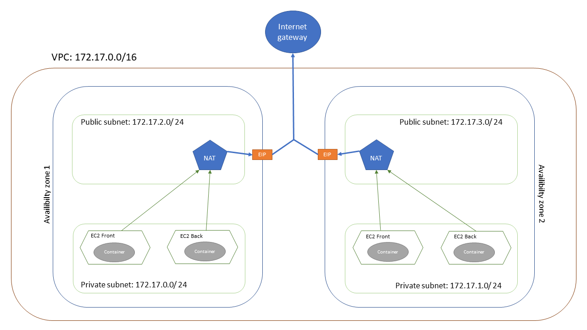

# ESGI cloud project

This project is configure to deploy a cloud infrastructure for a shop

## Element deploy
It deploy on AWS cloud:
* A lambda use to update the quantity of a product
* A simple queue service to receive events from the lambda
* A back end with two roles:
    * API to get and create products
    * Treat message from SQS
* A front end to display back end API data
* A DynamoDB table

## Parameters Needed

1. ```GITHUB_ACCESS_TOKEN```A github access token to allow AWS to add webhook to repositories use in the project

## Output

1. ```serverless_app_url``` The url to call the serverless app
2. ```back_end_app_url``` The url to call the back end
3. ```front_end_app_url``` The url to call the front end

## How to deploy

To deploy all the infrascture you only have to run terraform apply command. Front end and back end include CI/CD pipeline who automaticly build and deploy the code when deploying the infrastructure. No script is needed

## Network infrastructure schema
You will find below the network infrastructure created by the project


